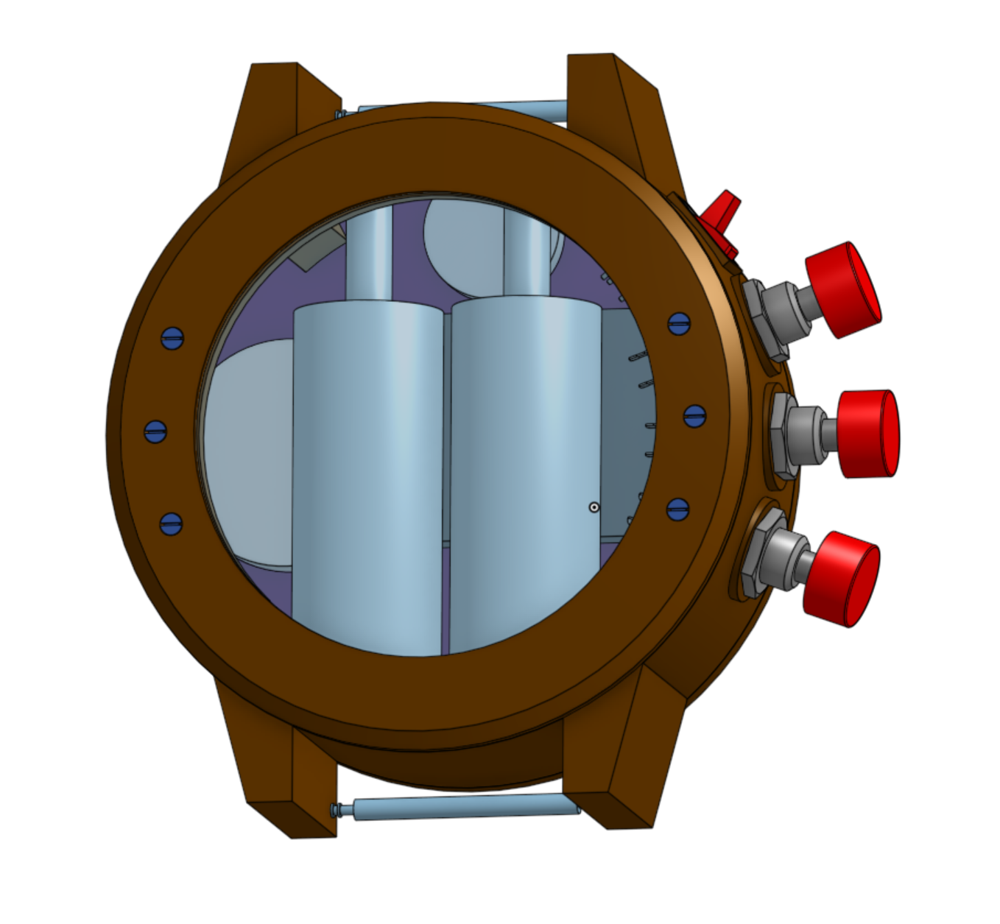

# Nixie Watch

The KiCad design files for a nixie-tube wristwatch. The mechanical design can be found at [this Onshape link](https://cad.onshape.com/documents/168decd161ae34bc06a36311/w/d9452b42c2f2de4575e19b2f/e/99e0d669777a0ebc0bf45485).

## Organization

 - `kicad/board`: The primary PCB design.
 - `kicad/riser`: The design for a riser board to mount nixie tubes and route their connections.
